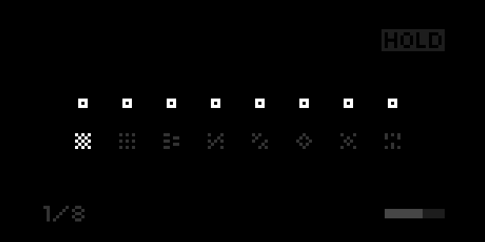

# Hopscotch

8-voice MIDI rhythmic arpeggiator for [norns](https://monome.org/norns/). Chat about it over on [lines](https://llllllll.co/t/hopscotch-midi-sequencer-arpeggiator/47655)

## Using Hopscotch

Play some notes with a MIDI input device and Hopscotch will map each note to its own selectable rhythm sequence. There is a 20% chance that the note will play 1 octave higher or lower when it is triggered. The output can be sent to a variety of devices. If using MIDI out, each of the 8 voices can be sent to any MIDI channel. Voices are assigned in the order that they are played, with each new note taking the first available space.

### Hardware requirements

- MIDI device to input notes
- A supported output device (see below)

You can choose input and output devices in the params menu

#### Currently supported output devices
- MIDI out
- Internal norns out (for now)
- Just Friends via [Crow](https://monome.org/#crow) (only supports 6 voices)

### Select a Sequence

Use encoder 2 to select which voice you would like to modify. Encoder 3 chooses the sequence.

The `!` option assigns a random sequence to that voice whenever a new note is played.

### Select a MIDI channel

*Note: You must choose MIDI as your output device to see these options*

Hold shift (key 1) to swap the sequencer options with MIDI channel options. Select which voice you want to modify with encoder 2, and choose a MIDI channel with encoder 3.

## Controls

- K1: shift - change midi channel
- K3: hold on/off
- E2: select a parameter
- E3: adjust parameter
